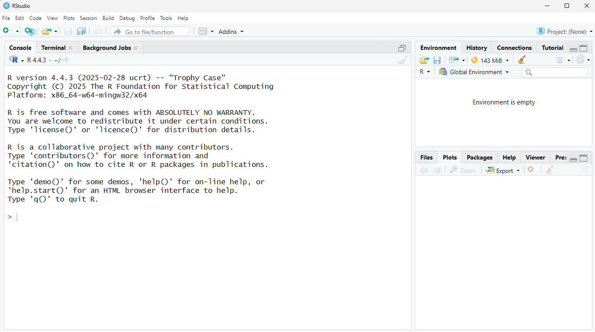
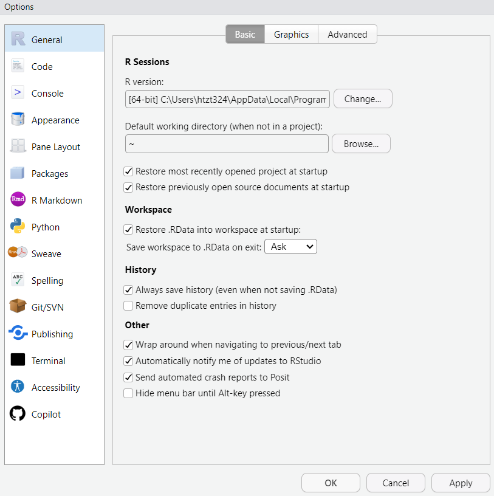
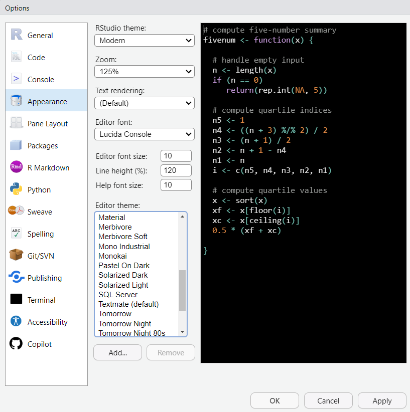

# (PART) Pre-Training Material {-}

# Setting up your computer

It's time to set up your system. Ready? Let's go.

## Install R {.unnumbered}


First, let's get the right programs installed on your computer. Then we will explain what they are and why you need them.   


**First, download and install `R`: **   

Go to the following website, click the *Download* button, and follow the website's instructions from there.
[https://mirrors.nics.utk.edu/cran/](https://mirrors.nics.utk.edu/cran/){target="blank"}

## Install RStudio {.unnumbered}


**Second, download and install `RStudio`:**    

Go to the following website and choose the free Desktop version:
[https://rstudio.com/products/rstudio/download/](https://rstudio.com/products/rstudio/download/){target="blank"}


**Third, make sure `RStudio` opens successfully:**    

Open the `RStudio` app. A window should appear that looks like this:
 



**Fourth, make sure `R` is running correctly in the background:**    

In `RStudio`, in the pane on the left (the "Console”), type 2+2 and hit Enter.  
If `R` is working properly, the number “4” will be printed in the next line down.


**Finally, some minor adjustments to make `RStudio` run smoother (and look cooler):**

Go to `Tools > Global Options` and make sure your `General` settings match these exactly:



Specifically, **uncheck** the option under *Workspace* to 'Restore .RData into workspace at startup.'  

Now go to the `Appearance` settings and choose a cool theme!



**Boom!**  You've got R up and running. Now it's time to install some packages.


## Install packages {.unnumbered}

Packages are what makes R so great. To install a package, open Rstudio, make sure you're connected to Wi-Fi, and type the following code into the "Console" in the bottom left


```{r, eval = FALSE}
install.packages('packagename')
```

Did that work? Probably not, because "packagename" is not a real R package. The packages we'll be using are the following:

```
tidyverse
RColorBrewer
leaflet
ggthemes
rmarkdown
sp
```

To install all of these, you can run `install.packages` for each package:

```{r, eval = FALSE, echo=TRUE}
install.packages('tidyverse')
install.packages('RColorBrewer')
# etc., etc.
```

So, now you've got R, RStudio, and some cool packages. Good job. You're ready for the next module.

